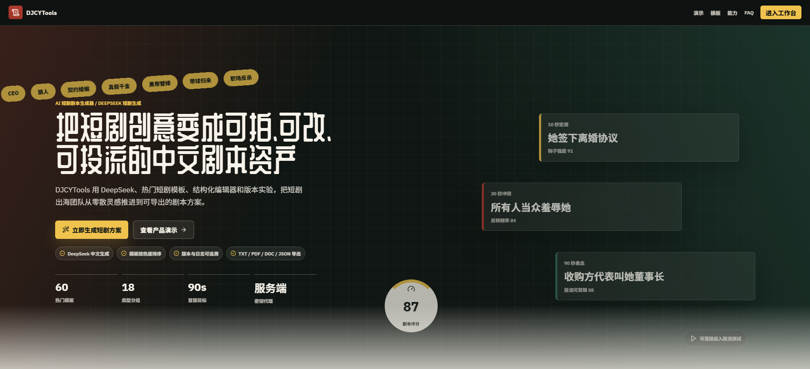
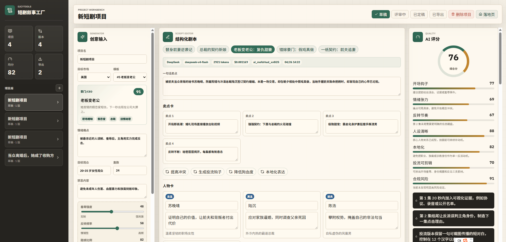

# DJCYTools AI 短剧叙事工厂

DJCYTools 是一个面向短剧出海团队的本地全栈 MVP。它落地页、DeepSeek 生成、结构化剧本编辑、版本实验、趋势参考、60 个热门模板、团队权限、导出、服务端 JSON 持久化和 AI 调用日志串成完整闭环。





## 当前入口

默认首页是产品落地页：

```text
http://127.0.0.1:5173/
http://127.0.0.1:4173/
```

工作台直达：

```text
http://127.0.0.1:5173/#workbench
http://127.0.0.1:4173/#workbench
```

## 启动方式

安装依赖：

```bash
npm install
```

开发环境：

```bash
npm run dev
```

开发地址：

```text
http://127.0.0.1:5173/
```

生产构建与启动：

```bash
npm run build
npm start
```

生产地址默认：

```text
http://127.0.0.1:4173/
```

## 环境变量

复制 `.env.example` 为 `.env` 并填写：

```text
DEEPSEEK_API_KEY=your_deepseek_api_key
DEEPSEEK_BASE_URL=https://api.deepseek.com
DEEPSEEK_MODEL=deepseek-v4-flash
```

`.env` 已被 `.gitignore` 忽略。DeepSeek API Key 只在服务端代理中使用，不会打进前端 bundle。

## 已实现能力

- 产品落地页：SEO 标题、结构化数据、首屏 CTA、社会证明、真实产品截图、工作流、模板展示、核心收益、试用反馈、FAQ、最终 CTA、Footer
- DeepSeek 生成短剧项目，输出简体中文结构化 JSON
- DeepSeek 定向改写：提高冲突、投流钩子、降低狗血度、本地化表达、评分建议改写
- 本地兜底生成，外部 API 失败时不阻塞工作流
- 结构化剧本编辑：剧名、卖点、人设、大纲、前 3 集脚本、核心对白
- 生成前准备度：检查项目名、情绪痛点、目标观众、模板、集数和钩子密度
- 模板预览：在生成表单中直接查看模板类型、热度、钩子和标签
- 投流钩子编辑：生成后可直接调整卖点卡和广告开场钩子
- 版本实验：版本保存、版本切换、版本对比、来源标记
- AI 评分：钩子、情绪、反转、人设、本地化、投流可剪辑、合规风险
- 60 个热门模板，按类型和热度排序
- 模板库管理：复制当前模板、保存团队自定义模板、编辑/删除自定义模板
- 趋势看板：情绪标签、模板信号、市场提示
- 团队权限：团队名、成员、角色编辑
- 导出：TXT / PDF / DOC / JSON
- 工作区备份与恢复：导出/导入完整 JSON 工作区
- 工作区归一化：旧缓存、服务端数据、备份导入都会补齐团队、设置、自定义模板和活跃项目字段
- 项目管理：状态流转、项目删除
- 服务端持久化：项目、版本、评论、导出记录、团队成员
- AI 调用日志：模型、token、耗时、估算成本、成功/失败状态
- 开发服务器和生产服务器共用同一套 API 内核

## 模板类型

当前内置 60 个热门短剧模板：

```text
豪门/CEO：5 个
婚恋甜虐：6 个
复仇逆袭：5 个
身份继承：4 个
家庭伦理：3 个
超自然狼人：4 个
黑帮危险恋人：2 个
职场现实：1 个
重生穿越：5 个
神医玄学：4 个
校园青春：3 个
萌宝亲情：3 个
法律悬疑：3 个
直播网红：2 个
职业竞技：3 个
阶层逆袭：3 个
熟龄情感：2 个
古装权谋：2 个
```

模板字段包括：

```text
id
name
type
category
heatRank
heatScore
tags
premise
lead
rival
hook
beat
defaultParams
```

## API

```text
GET  /api/health
GET  /api/workspace
PUT  /api/workspace
GET  /api/ai-logs
POST /api/generate-script
```

运行期数据写入：

```text
data/workspace.json
data/ai-logs.json
```

这两个文件默认被 `.gitignore` 忽略。

工作区备份文件包含项目、版本、评论、团队成员和自定义模板，可通过工作台右侧「运行状态」面板导入恢复。

## 主要文件

```text
src/LandingPage.jsx          落地页
src/App.jsx                  工作台主应用
src/data/templates.js        60 个模板和市场配置
src/data/trends.js           趋势和模板信号
src/lib/generator.js         本地生成、评分、版本工具
src/lib/deepseekClient.js    前端调用 DeepSeek 代理
src/lib/workspaceApi.js      前端工作区 API
server/apiCore.mjs           共享 API 内核
server.mjs                   生产服务器
vite.config.js               开发服务器与 API 插件
```

## 验证命令

```bash
npm run build
```

常用健康检查：

```bash
curl http://127.0.0.1:4173/api/health
curl http://127.0.0.1:4173/api/workspace
curl http://127.0.0.1:4173/api/ai-logs
```

## 后续建议

- 接入真实账号体系和团队登录
- 将 JSON 文件持久化升级为 PostgreSQL
- 增加模板后台管理和模板效果回流
- 增加投流结果字段，用于从导出版本回收测试数据
- 增加更细的合规审核和相似度检测
